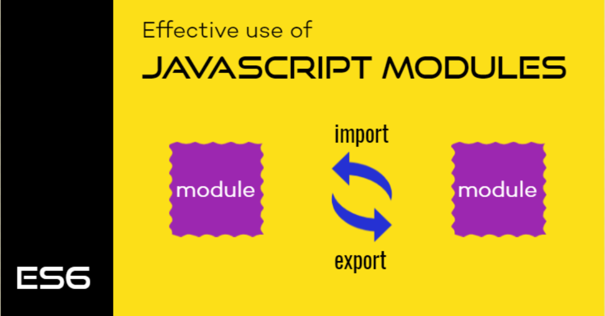
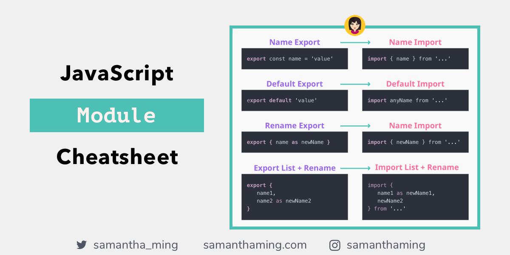

# Module
## As our program grows bigger, it may contain many lines of code Instead of putting everything in a single file, you can use modules to separate codes in separate files as per their functionality. This makes our code organized and easier to maintain.

### Suppose a file named main.js contains the following code:
```JS
    export function get(name){
        ...some code
    }
```
### • Then, we imported greetPerson() in another file using the import keyword. To import functions, objects, etc., you need to wrap them around { }.
```JS
    import {get} from './main.js';
```

# Export && Import
## Rename in the module (export file)
## We can change name of function or variable by writing "as" in the middle of evevry funtion or variables' names

